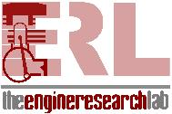
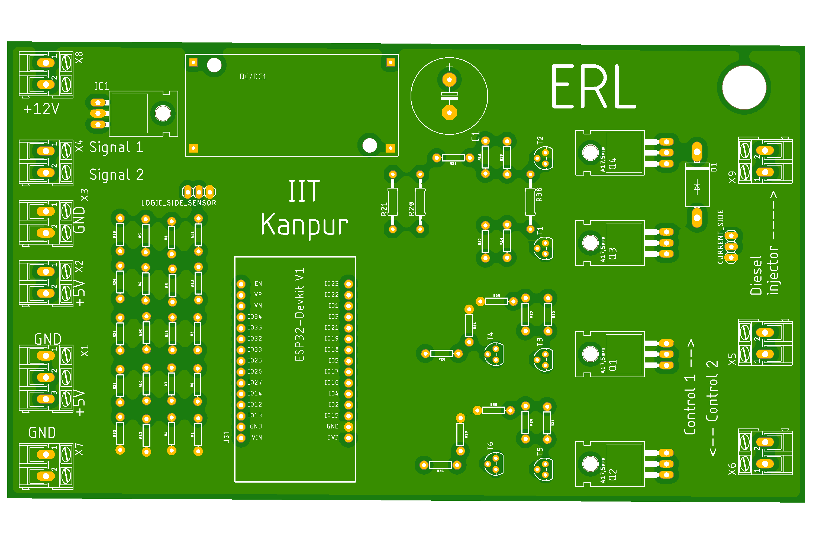
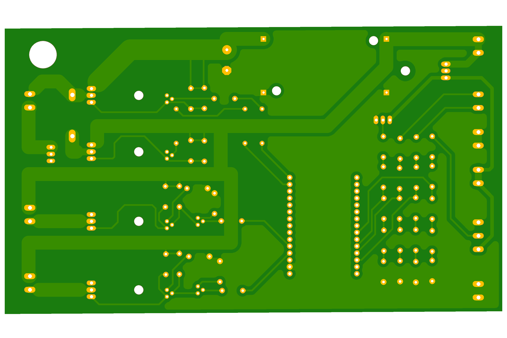

# Engine Control Unit (ECU) - Engine Research Laboratory (ERL), IIT Kanpur

<table>
  <tr>
    <td></td>
    <td></td>
  </tr>
</table>

Welcome to the Engine Control Unit (ECU) repository of the Engine Research Laboratory (ERL) at the Indian Institute of Technology Kanpur (IIT Kanpur). In this README, we will explore the significance of ECU, what it is, and how it plays a crucial role in modern engine research and development.

## Table of Contents
- [Introduction](#introduction)
- [Custom designed PCB](#custom-designed-pcb)
- [3D model](#3d-model)
- [Features](#features)
- [Getting Started](#getting-started)
- [License](#license)

---

## Introduction

The Engine Control Unit (ECU) is a vital component of modern internal combustion engines, serving as the "brain" that controls various aspects of engine operation. At the Engine Research Laboratory (ERL) at IIT Kanpur, we have developed an advanced ECU system to facilitate cutting-edge research and development in the field of internal combustion engines.

### Custom designed PCB

### [3D model](https://sketchfab.com/models/28feef1cc19342ffbb0c7c30adc009e6/embed?autostart=1)
Click the above heading to view a 3D model of the Engine Control Unit

### Precision Control
ECUs are crucial for optimizing the performance of internal combustion engines. They monitor and control critical parameters such as fuel injection timing, air-fuel mixture, ignition timing, and exhaust emissions. This precise control leads to improved fuel efficiency, reduced emissions, and enhanced engine performance.

### Adaptability
Modern ECUs are highly adaptable, allowing engine performance to be optimized under different operating conditions. They can adjust engine parameters in real-time to respond to changes in load, temperature, altitude, and other factors. This adaptability ensures that the engine operates efficiently and reliably in various environments.

### Emission Compliance
ECUs play a significant role in meeting stringent emission regulations. By precisely controlling combustion and exhaust processes, they help reduce harmful emissions such as nitrogen oxides (NOx), carbon monoxide (CO), and particulate matter (PM), contributing to a cleaner environment.

### Data Collection and Analysis
ECUs also serve as data hubs, collecting a vast amount of data from various engine sensors. Researchers at ERL can use this data to analyze engine performance, identify potential issues, and fine-tune engine designs.

## Features

Our ECU developed at ERL, IIT Kanpur, offers the following features:

- **Real-time Control**: The ECU provides real-time control of engine parameters for precise and efficient operation.
- **Adaptive Algorithms**: Adaptive algorithms ensure optimal engine performance across various operating conditions.
- **Data Logging**: Extensive data logging capabilities for research and analysis purposes.
- **Open Source**: Our ECU system is open-source, allowing researchers to modify and customize it for specific projects.
- **User-Friendly Interface**: An intuitive interface for configuring and monitoring engine parameters.

## Getting Started

To get started with our ECU system, follow these steps:

1. Clone this repository to your local machine.
2. Review the documentation in the `docs` folder for installation and usage instructions.
3. Connect the ECU to your test engine according to the provided guidelines.
4. Use the provided software tools to configure and monitor the ECU's operation.

For detailed installation and usage instructions, please refer to the documentation.

## License

This ECU system is open-source software released under the [MIT License](LICENSE). Feel free to use, modify, and distribute it in accordance with the license terms.

---

Thank you for your interest in the Engine Control Unit developed at the Engine Research Laboratory (ERL), IIT Kanpur. If you have any questions or would like to collaborate, please don't hesitate to [contact us](mailto:akag@iitk.ac.in)

